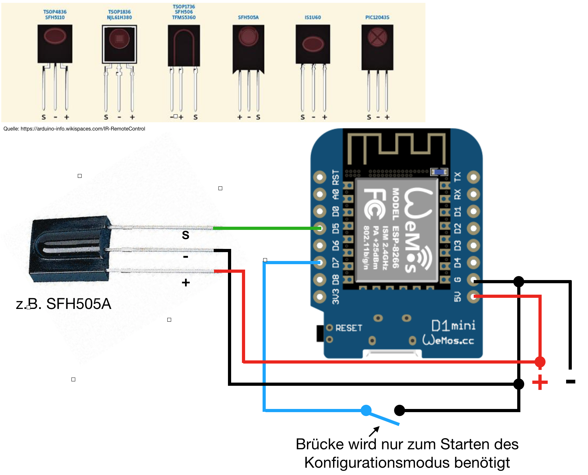

## WemosD1 HomeMatic IR Receiver



Programmbeispiel:
Schalten eines Aktors

Variablenname = Name der Variable für IR-Codes

FF1122334455 = empfangener IR-Code

AEQ0000000 = Seriennummer des Aktors


```
var ir = dom.GetObject("Variablenname").Value();
if (ir == "FF1122334455") {
	var status = dom.GetObject("BidCos-RF.AEQ0000000:1.STATE").Value();
	dom.GetObject("BidCos-RF.AEQ0000000:1.STATE").State(!status);
}
```
