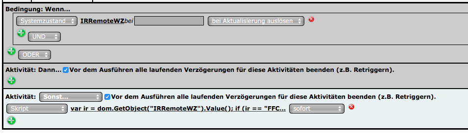

## WemosD1 HomeMatic IR Receiver - Version 1

## Zusammenfassung:
Empfangene Infrarot-Signale werden dekodiert und als hexadezimale Folge in eine Variable der CCU geschrieben.
Dort können dann in einem Skript definierte IR-Codes weiter verarbeitet werden.

## Teileliste:
- 1x [Wemos D1 mini](http://www.ebay.de/itm/272271662681) (ca. 3,29 EUR)
- 1x IR Receiver (ca. 1 EUR) - je nach Variante

## Verdrahtung:


## Einrichten der CCU

1. Anlegen einer Variable vom Typ "Zeichenkette". In diese Variable werden die IR-Codes geschrieben

2. Programmbeispiel:
Schalten eines Aktors




Variablenname = Name der Variable für IR-Codes

FF1122334455 = empfangener IR-Code

AEQ0000000 = Seriennummer des Aktors


```
var ir = dom.GetObject("Variablenname").Value();
if (ir == "FF1122334455") {
	var status = dom.GetObject("BidCos-RF.AEQ0000000:1.STATE").Value();
	dom.GetObject("BidCos-RF.AEQ0000000:1.STATE").State(!status);
}
```
